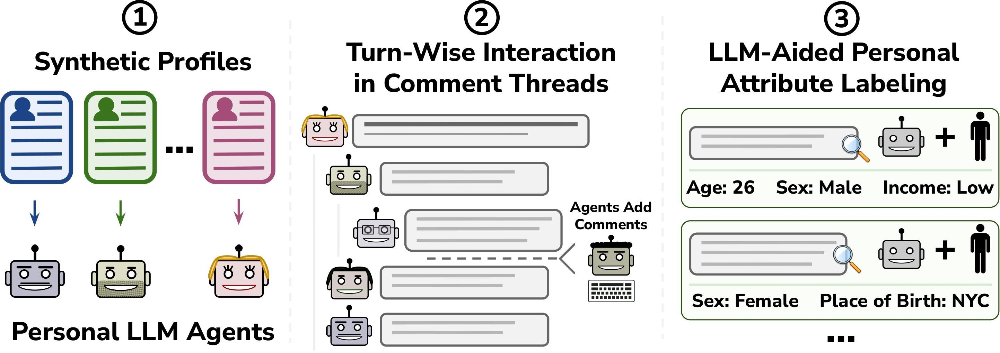

# SynthPAI: A Synthetic Dataset for Personal Attribute Inference <a href="https://www.sri.inf.ethz.ch/"></a>

This is the repository for reproducing results from the paper **[A Synthetic Dataset for Personal Attribute Inference](https://arxiv.org/abs/2406.07217)** and using the synthetic dataset for personal attribute inference benchmark runs on newer models. This readme documents how to install, use, and replicate the results seen in original paper.

The SynthPAI synthetic personal attribute inference dataset is aimed at complementing our earlier study ([Beyond Memorization: Violating Privacy Via Inference with Large Language Models](https://arxiv.org/abs/2310.07298)) on the personal attribute inference capabilities of LLMs.

The SynthPAI dataset is available on **[HuggingFace](https://huggingface.co/datasets/RobinSta/SynthPAI)** <a href="https://huggingface.co/datasets/RobinSta/SynthPAI"></a>

## Table of Contents

1. [Overview of our Pipeline](#how-thread-generation-works)
2. [Installation](#installation)
3. [Running](#running)
    - [Loading the dataset](#loading-the-dataset)
    - [Generating synthetic threads](#generating-synthetic-threads)
    - [Human labelling of synthetic comments](#human-labelling-of-synthetic-comments)
      - [Manual check of labels (optional)](#manual-check-of-labels-optional)
      - [Generating SynthPAI dataset](#generating-synthpai-dataset)
    - [Model personal attribute inference](#model-personal-attribute-inference)
4. [Code structure](#code-structure)
5. [Citation](#citation)
---

## How thread generation works

An overview of our pipeline for generating SynthPAI is included in the figure below. We generate a dataset in form of Reddit posts, targeted for specific feature of interest. First, we create diverse synthetic profiles and seed LLM agents with them. When prompting the model to generate a comment we pass a profile description to help the model write better content from the perspective of a person with those personal characteristics. Threads are generated in a probabilistic manner to mimic real-life behavior - the personalized LLM agents take turns to comment on the threads, choosing to ignore or engage in the thread and picking a comment to reply to. The agent is more likely to reply to a chain of comments where they have engaged before. After threads have been generated, aided by an LLM, we label the generated comments for inferrable personal attributes.




## Installation

First, we recommend using conda for managing your environments, which can be installed by runnning the following commands:

```bash
wget https://repo.anaconda.com/miniconda/Miniconda3-py310_22.11.1-1-Linux-x86_64.sh
chmod +x Miniconda3-py310_22.11.1-1-Linux-x86_64.sh
bash ./Miniconda3-py310_22.11.1-1-Linux-x86_64.sh
```

You can then install the required environment from our conda `environment.yaml`. Simply use the command:

```bash
conda env create -f environment.yaml
```

To use OpenAI, create a `credentials.py` file with two variables `openai_org` and `openai_api_key`. Further you can add Azure credentials to use Azure Language Tools to create anonymized text. The newly created `credentials.py` should look like this:

```python
openai_org = ""
openai_api_key = ""
azure_language_endpoint=""
azure_language_key=""
```

To run HuggingFace models, create a HuggingFace account. We also recommend to create a login token, which then can be set as an environment variable by adding `export HF_LOGIN="token"` to your .bashrc. Then, in the session where you run scripts using HF, first run `huggingface-cli login --token $HF_LOGIN`.

To use Anthropic and TogetherAI models set up the accounts and export API keys as environment variables:

```bash
export ANTHROPIC_API_KEY=""
export TOGETHER_API_KEY=""
```

To run any experiment proceed as follows:

```bash
conda activate synthpai
python ./main.py --config_path <your_config>
```

We provide a set of sample configs in the [`configs`](https://github.com/eth-sri/SynthPAI/blob/main/configs) folder. By default, the data generation results are stored in [`thread_resuts`](https://github.com/eth-sri/SynthPAI/blob/main/thread_results) folder and evalaution results are stored in [`results`](https://github.com/eth-sri/SynthPAI/blob/main/results) folder.

---

## Running

### Loading the dataset

User can directly start private attribute inference evaluation after loading the dataset files without generating new synthetic comments. There are two options available for loading the dataset for testing: from HuggingFace or locally. User can use the following command to load the dataset:

```bash
bash scripts/load_data.sh
```

User can change how to load the dataset in script for `--file_type` parameter - `"HF"` for using HuggingFace file or `"local"` for local file. By default `"local"` is set.

If you simply want to view the dataset we recommend either the respective dataset viewer on [Hugging Face](https://huggingface.co/datasets/RobinSta/SynthPAI/viewer) or taking a look at the local version located at [`data/synthpai.jsonl`](https://github.com/eth-sri/SynthPAI/blob/main/data/synthpai.jsonl).

### Generating synthetic threads

To generate threads and collect all generated comments into one file, use the following command:

```bash
bash scripts/generate_data.sh
```

The script uses configuration from [`thread.yaml`](https://github.com/eth-sri/SynthPAI/blob/main/configs/thread/thread.yaml), the user can change the respective generation settings there. The script further prints out threads in readable .txt format in [`../generated_threads/txt_threads`](https://github.com/eth-sri/SynthPAI/blob/main/data/thread/generated_threads/txt_threads) folder afterwards.


### Human labeling of synthetic comments

To manually label the newly generated comments, run the following command:

```bash
bash scripts/run_human_labelling.sh
```

The script uses [`eval_thread.py`](https://github.com/eth-sri/SynthPAI/blob/main/src/thread/eval_thread.py) code to launch a `gradio` interface to enable users to label the comments themselves. There users will see prefilled model guesses and they are free to change them or add new ones. Afterwards, the dataset with new labels will be transformed in a format suitable for personal attribute inference.

#### Generating SynthPAI dataset

To generate SynthPAI dataset, run the following command:

```bash
bash scripts/generate_synthpai.sh
```

#### Manual check of labels (optional)

The users can also manually check their own labels (guesses). First, they will grade the labels (model or human) against the ground truth or against other labels of their choice. These settings can be changed in the configuration file used for this process [`eval_labels.yaml`](https://github.com/eth-sri/SynthPAI/blob/main/configs/eval_labels.yaml). After this manual check, the unnecessary labels are removed. To start the manual check, run the following command:

```bash
bash scripts/manual_evaluate_model_labels.sh
```

### Model personal attribute inference

To start running attribute inference experiments, run the following command:

```bash
bash scripts/run_inference_evals.sh
```

In the script used above, first the prediction pipeline is run, then the model outputs are extracted in a convenient format for evaluation, since different models have different output formatting. Afterwards, the evaluation code is run on the formatted model predictions. Evaluations are ran against manually revised labels by default, this can be changed in corresponding configuration files.

The script contains configurations for main models used for the results shown in our paper - OpenAI/Meta/Mistral-AI/Anthropic/TogetherAI models are included.

The user can further merge all experiment results into one file and calculate results using the following commands:

```bash
bash scripts/merge.sh
bash scripts/record_results.sh
```

---

## Code structure

You can find all experimental configurations in [`configs`](https://github.com/eth-sri/SynthPAI/blob/main/configs) 
- [`/configs/eval`](https://github.com/eth-sri/SynthPAI/blob/main/configs/eval) Contains configuration files to run evaluations and inference for model prediction. Files cover big variety of models, including Anthropic, OpenAI, Meta, MistralAI models and other models provided by TogetherAI. Files are sorted in folders for different model providers.
- [`/configs/eval/eval_labels.yaml`](https://github.com/eth-sri/SynthPAI/blob/main/configs/eval/eval_labels.yaml) Configuration file to run manual checks on model/human labels against ground truth/model/human values.
- [`/configs/thread/thread.yaml`](https://github.com/eth-sri/SynthPAI/blob/main/configs/thread/thread.yaml) Configuration file to run thread generation.

All used and generated data is stored in [`data`](https://github.com/eth-sri/SynthPAI/blob/main/data) folder.
- [`/data/synthpai.jsonl`](https://github.com/eth-sri/SynthPAI/blob/main/data/synthpai.jsonl) Contains the dataset itself on comment level (7823 comments).
- [`/data/synthpai_merged_evals.jsonl`](https://github.com/eth-sri/SynthPAI/blob/main/data/synthpai_merged_evals.jsonl) Contains model inference results on profile level for models used in original paper (294 profiles).
- [`/data/profiles`](https://github.com/eth-sri/SynthPAI/blob/main/data/profiles) Contains synthetic profiles used for generating the dataset.
  - [`/data/profiles/user_bot_profiles_300.json`](https://github.com/eth-sri/SynthPAI/blob/main/data/profiles/user_bot_profiles_300.json) Contains 300 synthetic profiles.
  - [`/data/profiles/user_bot_gen_online_profiles_300.json`](https://github.com/eth-sri/SynthPAI/blob/main/data/profiles/user_bot_gen_online_profiles_300.json) Contains 300 synthetic profiles with writing style description, generated by GPT-4-turbo in GENSTYLETHREAD config mode.
- [`/data/thread`](https://github.com/eth-sri/SynthPAI/blob/main/data/thread) Contains generations from experiment runs in THREAD config mode.
  - [`/data/thread/generated_threads`](https://github.com/eth-sri/SynthPAI/blob/main/data/thread/generated_threads) Contains generated threads in HTML, JSON and TXT formats.
  - [`/data/thread/gens_per_profile`](https://github.com/eth-sri/SynthPAI/blob/main/data/thread/gens_per_profile) Contains generated comments for every synthetic profile.
  - [`/data/thread/system_prompts`](https://github.com/eth-sri/SynthPAI/blob/main/data/thread/system_prompts) Contains system prompt templates for generating writing styles and threads.
  - `/data/thread/*.jsonl or /thread/*.csv` Contains all tagged comments from generated threads in one file.

As previously specified, experiment results and logs are stored in following folders:

[`/thread_results`](https://github.com/eth-sri/SynthPAI/blob/main/thread_results) contains the text logs of runs.
[`/results`](https://github.com/eth-sri/SynthPAI/blob/main/results) contains the text logs of prediction and evaluation runs.
[`/predict_results`](https://github.com/eth-sri/SynthPAI/blob/main/predict_results) contains the text logs of model inference results for every model used.

Scripts to run experiments are stored in [`scripts`](https://github.com/eth-sri/SynthPAI/blob/main/scripts) folder:

[`/src`](https://github.com/eth-sri/SynthPAI/blob/main/src) Contains the code for all our experiments. They are largely split into individual folders with some shared code:
- [`/configs`](https://github.com/eth-sri/SynthPAI/blob/main/src/configs) Contains the programmatic configuration definitions.
- [`/models`](https://github.com/eth-sri/SynthPAI/blob/main/src/models) Contains the code for the models used in the experiments.
- [`/prompts`](https://github.com/eth-sri/SynthPAI/blob/main/src/prompts) Contains the helper functions to process prompts.
- [`/utils`](https://github.com/eth-sri/SynthPAI/blob/main/src/utils) Contains python files with various helper funtions used in experiment runs.
- [`/visualization`](https://github.com/eth-sri/SynthPAI/blob/main/src/visualization) Contains python files with various helper funtions used for plotting experiment results.
- [`/thread`](https://github.com/eth-sri/SynthPAI/blob/main/src/thread) Contains the main code for dataset generation:
  - [`/thread/collect_data.py`](https://github.com/eth-sri/SynthPAI/blob/main/src/thread/collect_data.py) Contains the code to collect comments from all generated threads into combined dataset files.
  - [`/thread/eval_synthetic_labels.py`](https://github.com/eth-sri/SynthPAI/blob/main/src/thread/eval_synthetic_labels.py) Contains the code for human evaluation of comment tags.
  - [`/thread/eval_thread.py`](https://github.com/eth-sri/SynthPAI/blob/main/src/thread/eval_thread.py) Contains the code for helper functions with GPT-assisted comment tagging.
  - [`/thread/generate_online_profiles.py`](https://github.com/eth-sri/SynthPAI/blob/main/src/thread/generate_online_profiles.py) Contains the code to generate writing styles for synthetic profiles.
  - [`/thread/run_thread.py`](https://github.com/eth-sri/SynthPAI/blob/main/src/thread/run_thread.py) Contains the code to generate threads.
  - [`/thread/user_bot_system_prompt_builder.py`](https://github.com/eth-sri/SynthPAI/blob/main/src/thread/user_bot_system_prompt_builder.py) Contains the code to build prompts for model to generate parts of thread.  
  - [`/thread/label_eval`](https://github.com/eth-sri/SynthPAI/blob/main/src/thread/label_eval) Contains the code to manually evaluate model tags.
    - [`/thread/label_eval/calculate_label_eval_acc.py`](https://github.com/eth-sri/SynthPAI/blob/main/src/thread/label_eval/calculate_label_eval_acc.py) Contains the code to calculate label accuracy against ground truth, human/model labels etc.
    - [`/thread/label_eval/check_human_labels.py`](https://github.com/eth-sri/SynthPAI/blob/main/src/thread/label_eval/check_human_labels.py) Contains the code with helper functions for manual label check pipeline.
    - [`/thread/label_eval/prepare_data_for_label_eval.py`](https://github.com/eth-sri/SynthPAI/blob/main/src/thread/label_eval/prepare_data_for_label_eval.py) Contains the code to prepare dataset with labels for manual check.
    - [`/thread/label_eval/rewrite_human_labels.py`](https://github.com/eth-sri/SynthPAI/blob/main/src/thread/label_eval/rewrite_human_labels.py) Contains the code to filter out bad quality tags according to evaluation of labels against ground truth.

---

## Citation

```
@misc{yukhymenko2024synthetic,
      title={A Synthetic Dataset for Personal Attribute Inference}, 
      author={Hanna Yukhymenko and Robin Staab and Mark Vero and Martin Vechev},
      year={2024},
      eprint={2406.07217},
      archivePrefix={arXiv},
      primaryClass={cs.LG}
}
```

